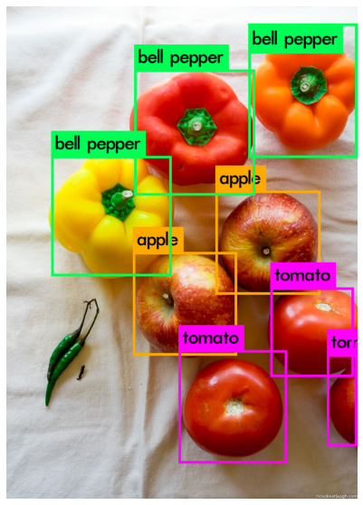

# How to train YOLOv3 on Google Colab

This repo contains Google Colab Notebooks simplified from [this post]((http://blog.ibanyez.info/blogs/coding/20190410-run-a-google-colab-notebook-to-train-yolov3-using-darknet-in/), along with example data and configuration files to get you up and running right away.

These Colab notebooks and the accompanying files will show you how to:

* Train a **YOLOv3** model using **Darknet** using the Colab **12GB-RAM GPU**
* Sync Colab with your Google Drive to automatically backup trained weights
* See how to configure **YOLOv3** training on your own dataset

After running this, you should have a trained YOLOv3 model that can detect apples, tomatoes, and bell peppers.



Delicious :)

# Instructions

## Setup on Google Drive

#### Get these project files

Clone this repository from Github and upload the `yolo_colab` folder to your Google Drive. Make sure the folder is named`yolo_colab` and that it sits in the main (My Drive) directory of your Google Drive.

#### Get External CUDA cuDNN libraries

The only thing you need to get outside of this package are the CUDA DNN libraries.  I can't package them because CUDA's license says that you must download them yourself.  You'll need to check your Colab environment for which version of CUDA you are running.  See the first notebook (`DarknetYOLOTrain_Init.ipynb`) for more details on how to download and where to put the files.


## Running the notebooks

Open the notebooks on Google Colab and follow the instructions inside.

#### Notebook 1: DarknetYOLOTrain_Init.ipynb

This notebook covers the setup of darknet and initial training (approx. 12 hours) with the provided dataset and config files.

1. Connecting between Google Drive and Colab for file storage
2. Install of CUDA cuDNN library
3. install of darknet on Colab and storage of compiled darknet binary on Google Drive for later reuse
4. importing config and training data images from Google Drive
5. Downloading initial pretrained weights
6. Training model and storing trained weights in Google Drive in `backup/yolov3_last.weights`

#### Notebook 2: DarknetYOLOTest.ipynb

1. Reloading model from weights from Google Drive
2. Using model weights to perform object detection on an example file


#### Notebook 3: DarknetYOLOTrain_Repeat.ipynb

This notebook is similar to Notebook 1, but reuses the previously saved binaries to quickly reinitialize the runtime for repeated training.  It reloads previously trained model weights from `backup/yolov3_last.weights`.

##### Adding more data

You can always add more annotated data and continue training with this script. Just add the images and annotations to `img.tar.gz` and add the file locations to the `cfg/train.txt` file.  To annotate more images, I suggest checking out [this project](https://github.com/miki998/YoloV3_Annotation_Tool).

## Using your own data

You can replace the data in `img.tar.gz` with your own annotated images for training. In addition to replacing the data you will need to update the following files.

#### 1. `cfg/train.txt`:
Update this to refer to the new image file names in `img.tar.gz`
#### 2. `cfg/obj.names`:
Update this with the new class names. Make sure they are defined in the same order as in
#### 3. `cfg/yolov3.cfg`:
This just needs to be updated with the new number of classes (if you are still using 3 classes then there is no need for a change).  Edit the following lines of `cfg/yolov3.cfg`, based on the number of classes that you are actually using.

```
Line 603: set filters=(number of classes + 5)*3
Line 610: set classes=the number of classes you want to detect
Line 689: set filters=(number of classes + 5)*3
Line 696: set classes=the number of classes you want to detect
Line 776: set filters=(number of classes + 5)*3 in our case filters=21
Line 783: set classes=the number of classes you want to detect
```

After making these changes, you can run through the above 3 notebooks in the same order to train your dataset.

# Contact

If you have any issues or questions feel free to reach out to me on Twitter [@bonkerfield](https://twitter.com/bonkerfield) or file an issue here. Thanks

# Credits

For this example, I just simplified the tutorial from [this repo](https://github.com/kriyeng/yolo-on-colab-notebook) by [David Ibáñez](https://github.com/kriyeng) and added data from Google [OpenImages](https://storage.googleapis.com/openimages/web/index.html). You can find the original post with more explanations about this notebook at [How to train YOLOv3 using Darknet framework and optimize the VM runtime load times](http://blog.ibanyez.info/blogs/coding/20190410-run-a-google-colab-notebook-to-train-yolov3-using-darknet-in/). Instructions on how change config files for new data are adapted from [this post](https://medium.com/@manivannan_data/how-to-train-yolov3-to-detect-custom-objects-ccbcafeb13d2).
